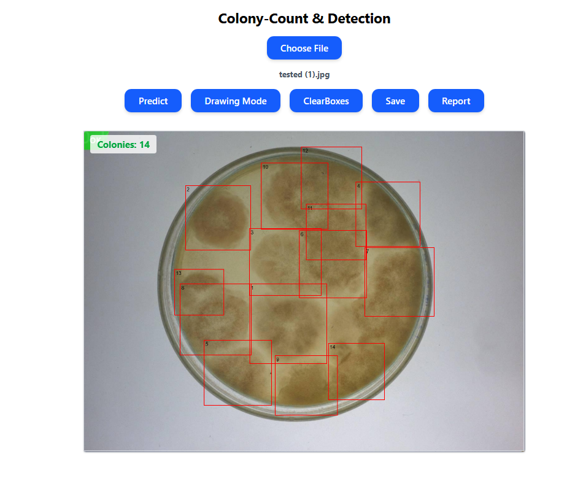
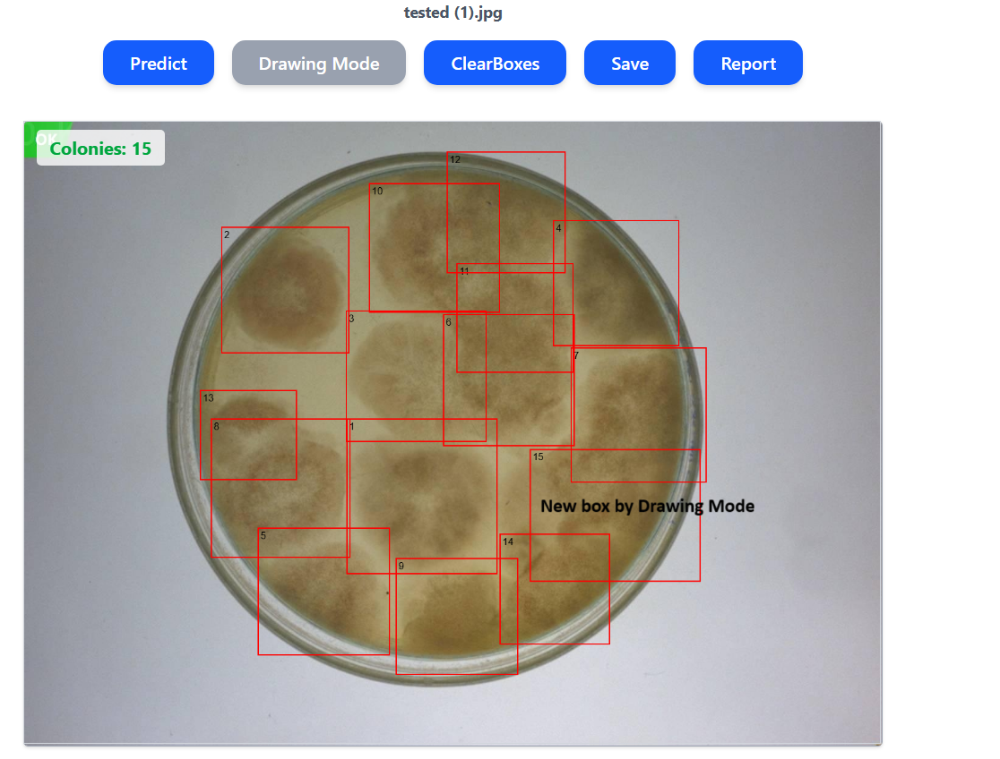
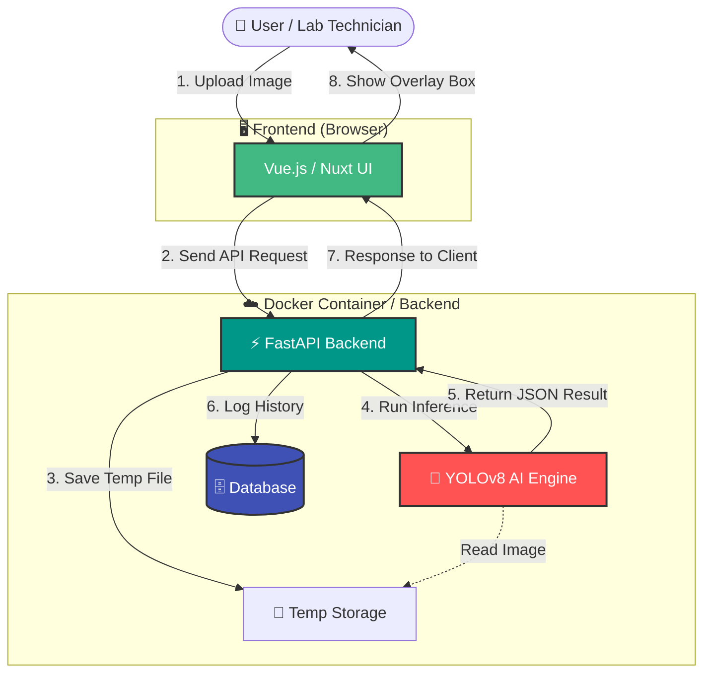
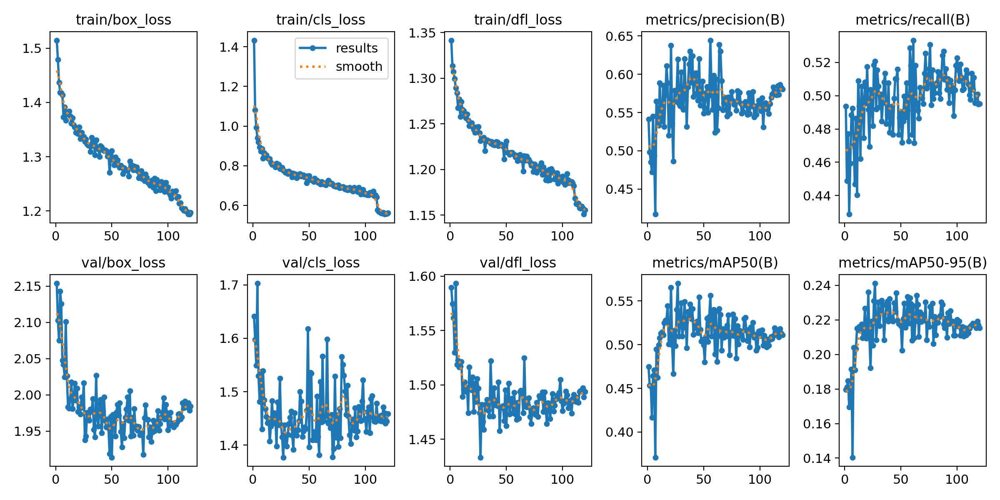
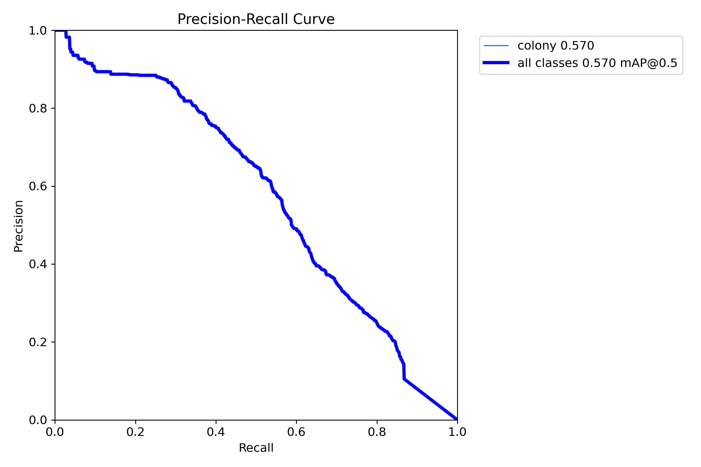

# 🧫 AI Colony Detection System (Colony-Count-YOLO)

> **⚠️ Disclaimer:** This repository serves as a **technical portfolio showcase**. The source code is currently private. This document details the system architecture, development methodology, and performance metrics.

---

## 📖 Executive Summary
Counting bacterial colonies on petri dishes is a fundamental but tedious task in microbiology. Manual counting is time-consuming and prone to human error.

**Colony-Count-YOLO** is an end-to-end web application that automates this process using computer vision. It allows users to upload images, receive instant counts with visual bounding boxes, manually correct the results (Human-in-the-loop), and export reports. The system is containerized for easy deployment and supports GPU acceleration.

---

## 👁️ Visual Demonstration

### 1. Detection Results (Before vs. After)
The model effectively detects colonies even in challenging lighting conditions or with high density.

*Left: Raw Input Image | Right: AI Detection Output (Count: 14)*

### 2. User Interface Workflow
The web interface is designed for intuitive usage by lab technicians.

| Image Upload | Interactive Detection & Editing |
| :---: | :---: |
|  |  |
| *Simple drag-and-drop interface* | *Canvas-based editor for manual corrections* |

---

## 🏗️ System Architecture
The system follows a microservices-like architecture, separating the heavy AI inference from the client-side interaction.

**Core Components:**
* **Frontend (Vue.js / Nuxt):** Handles image uploads and utilizes HTML5 Canvas for an interactive bounding-box editor (allowing users to add/delete/resize boxes).
* **Backend (FastAPI):** Asynchronous API that manages the inference pipeline, image storage, and database transactions.
* **AI Engine (Ultralytics YOLO):** Runs inference on the GPU, featuring custom logic for Non-Maximum Suppression (NMS) tuning.
* **Database (SQLite/PostgreSQL):** Stores prediction history, metadata, and user-edited counts for future model fine-tuning.

---

## 🧠 AI Methodology & Training

### 1. Dataset Preparation
* **Data Collection:** Custom dataset of petri dish images.
* **Annotation:** Labeled using standard YOLO format (normalized coordinates).
* **Augmentation Strategy:** To ensure robustness against lighting variations, the following augmentations were applied during training:
    * *CLAHE (Contrast Limited Adaptive Histogram Equalization)*
    * *Random Brightness/Contrast*
    * *Mosaic & Mixup* (to handle overlapping colonies)
    * *Random Flip/Rotation*

### 2. Model Training
Trained using **YOLOv8 / YOLOv11** architectures via Transfer Learning.

* **Hyperparameters:**
    * `imgsz`: 832 (High resolution for small objects)
    * `epochs`: 100+ (with Early Stopping)
    * `batch`: 16
    * `optimizer`: AdamW

---

## 📊 Performance & Evaluation

The model was trained for over 100 epochs. Below are the actual metrics obtained from the validation set.

### 1. Training Dynamics
The training curves show a steady decrease in loss, indicating that the model successfully learned to generalize features of the colonies.

*Figure 1: Comprehensive training metrics showing Box Loss convergence and mAP improvement.*

### 2. Precision-Recall Curve
The model achieves a **mAP@0.5 of 0.57**, which establishes a solid baseline for detecting small, dense objects like bacterial colonies.

*Figure 2: Precision-Recall curve illustrating the trade-off between detection accuracy and coverage.*

### Key Performance Indicators (Actual)
| Metric | Value | Interpretation |
| :--- | :--- | :--- |
| **mAP@0.5** | **0.57** | Moderate detection capability; suitable for assisted counting. |
| **Best F1 Score**| **0.56** | Achieved at confidence threshold of **0.262**. |
| **Precision** | **~0.60** | The model is fairly conservative in its predictions. |
| **Inference Speed** | **~76ms** | Fast enough for web-based interactive usage. |

---

## 🛠️ Technical Stack

**Data Science & AI**
* Python (Pandas, NumPy, OpenCV)
* PyTorch (CUDA supported)
* Ultralytics YOLOv8/v11

**Web Development**
* **Backend:** FastAPI, Pydantic, SQLAlchemy, Uvicorn
* **Frontend:** Vue.js 3, Nuxt, TailwindCSS, Axios
* **Database:** SQLite (Dev), PostgreSQL (Prod ready)

**DevOps & Tools**
* Docker & Docker Compose
* Git / GitHub
* NVIDIA Container Toolkit

---

## 🚀 Key Features Highlights
1.  **Human-in-the-loop:** The AI provides the initial count, but users can refine the results. These "corrected" annotations are saved and can be used to re-train the model, creating a continuous learning loop.
2.  **Report Generation:** Automated PDF/CSV export containing image thumbnails, total counts, and confidence scores for lab records.
3.  **Adaptive Thresholding:** Users can adjust confidence thresholds dynamically on the frontend to filter out noise without re-running the model.

---
